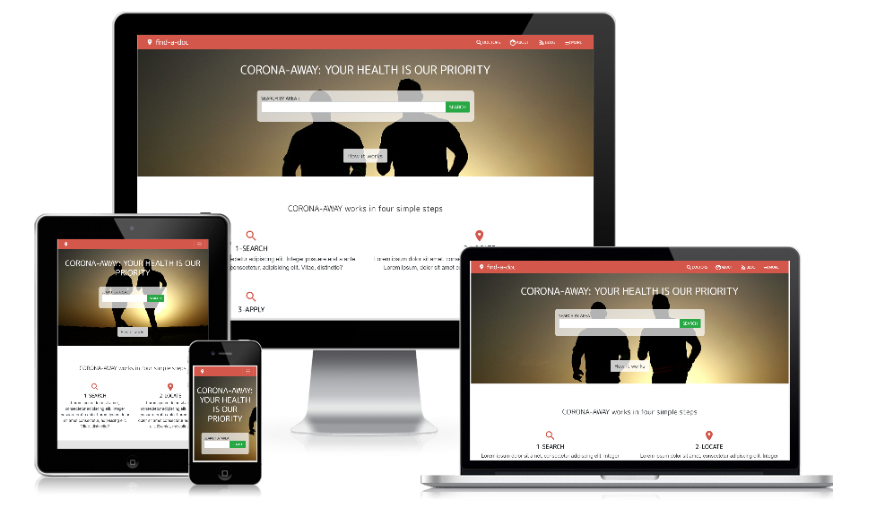

# CORONA AWAY

> On online lookup directory for covid 19. Helping individuals locate nearest test centers and get basic information/contact the institutions.

Additional description about the project and its features.

## Built With

- HTML
- Bootstrap
- CSS

## Live Demo

[Live Demo Link](#)

## Getting Started

To get a local copy up and running follow these simple example steps.

### Prerequisites

- Modern browser
- Internet connection

### Usage

Open the live link 

## Authors

👤 **Author1**

- Github: [@simandebvu](https://github.com/simandebvu)
- Twitter: [@simandebvu](https://twitter.com/simandebvu)
- Linkedin: [simandebvu](https://linkedin.com/in/simandebvu)

## 🤝 Contributing

Contributions, issues and feature requests are welcome!

Feel free to check the [issues page](issues/).

## Show your support

Give a ⭐️ if you like this project!

## Acknowledgments

- Microverse

## 📝 License

This project is [MIT](LICENSE.md) licensed.
